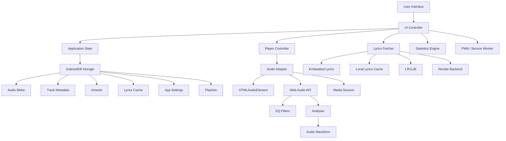

# Mujic

> A lightweight, local-first, offline music player built for people who want their music library to stay on their device — fast, private, uncluttered, and free from ads.

[](./LICENSE)
[](./manifest.webmanifest)
[](#offline-first-architecture)
[](#why-mujic)

**Mujic** is an open-source, local-first music player designed especially for low-end devices, limited-connectivity environments, and users who prefer a clean music experience without ads, accounts, feeds, or unnecessary UI clutter.

Created by **Ashutosh Roy (aka Mackkar)**.

- GitHub: https://github.com/royverse69/mujic
- License: MIT
- Project type: installable Progressive Web App (PWA)
- Primary architecture: single-page HTML application with browser-native storage and media APIs

---

## Table of Contents

1. [What Mujic Is](#what-mujic-is)
2. [Why Mujic](#why-mujic)
3. [Core Design Principles](#core-design-principles)
4. [Feature Overview](#feature-overview)
5. [Application Architecture](#application-architecture)
6. [Offline-First Architecture](#offline-first-architecture)
7. [Library Management](#library-management)
8. [Audio Import and Metadata Extraction](#audio-import-and-metadata-extraction)
9. [Artwork and Image Caching](#artwork-and-image-caching)
10. [Playback Engine](#playback-engine)
11. [Queue, Shuffle, Repeat, and Playback Order](#queue-shuffle-repeat-and-playback-order)
12. [Mini Player and Full Player](#mini-player-and-full-player)
13. [Lyrics System](#lyrics-system)
14. [Lyrics Fallback Chain](#lyrics-fallback-chain)
15. [Lyrics Caching and Offline Lyrics](#lyrics-caching-and-offline-lyrics)
16. [Audio Equalizer](#audio-equalizer)
17. [Audio Waveform](#audio-waveform)
18. [Listening Statistics](#listening-statistics)
19. [Search](#search)
20. [Artists](#artists)
21. [Albums](#albums)
22. [Playlists](#playlists)
23. [Home Experience](#home-experience)
24. [History and Favorites](#history-and-favorites)
25. [Themes and Appearance](#themes-and-appearance)
26. [Responsive Design](#responsive-design)
27. [Glass UI System](#glass-ui-system)
28. [PWA and Installation](#pwa-and-installation)
29. [Service Worker and Caching](#service-worker-and-caching)
30. [Media Session and Lock-Screen Controls](#media-session-and-lock-screen-controls)
31. [Playback Resume](#playback-resume)
32. [Importing Music Into a Playlist](#importing-music-into-a-playlist)
33. [Exporting Settings and Statistics](#exporting-settings-and-statistics)
34. [Storage Model](#storage-model)
35. [Data Lifecycle](#data-lifecycle)
36. [Privacy Model](#privacy-model)
37. [Supported Audio Formats](#supported-audio-formats)
38. [Browser Compatibility](#browser-compatibility)
39. [Low-End Device Strategy](#low-end-device-strategy)
40. [Project Structure](#project-structure)
41. [Running Locally](#running-locally)
42. [Installing as a PWA](#installing-as-a-pwa)
43. [Development Notes](#development-notes)
44. [Troubleshooting](#troubleshooting)
45. [Contributing](#contributing)
46. [Security and Privacy Issues](#security-and-privacy-issues)
47. [Roadmap](#roadmap)
48. [License](#license)
49. [Credits](#credits)

---

## What Mujic Is

Mujic is a **local-first music player**.

The important part of that definition is **local-first**.

The music library itself is not represented as a remote catalog. When the user imports a file, Mujic stores the actual audio file in the browser's IndexedDB storage and stores the song's metadata separately. Artwork and lyrics cache data are also stored locally.

The result is a player that can continue to work even when the internet is unavailable.

The network is treated as an enhancement layer rather than the foundation of playback.

Typical workflow:

```text
Import local music
      ↓
Read metadata / artwork / embedded lyrics
      ↓
Store audio + metadata + artwork locally
      ↓
Build local library
      ↓
Playback directly from IndexedDB
      ↓
Cache optional online lyrics
      ↓
Continue playing locally when offline
```

Mujic deliberately avoids turning the home screen into a social feed or advertising surface. The interface focuses on the user's own collection.

---

## Why Mujic

Mujic is built around a very simple idea:

> Your music library should feel like a local collection, not a website pretending to be one.

The project targets users who care about:

- offline playback
- low memory and CPU overhead
- low-end Android phones
- local music ownership
- no ads
- no account requirement for the local library
- fast startup
- straightforward controls
- a clean visual hierarchy
- an installable app-like experience

The current application contains no advertising layer or ad SDK in the player interface.

---

# Core Design Principles

## 1. Local first

Audio playback should not depend on a live music service.

## 2. Offline capable

Imported audio remains available from browser storage after the network disappears, subject to browser storage persistence and codec support.

## 3. Minimal UI

Mujic intentionally avoids unnecessary cards, feeds, advertisements, or large amounts of decorative information.

## 4. Progressive enhancement

When browser capabilities exist, Mujic uses them:

- Web Audio API
- Media Session API
- Pointer Events
- IndexedDB
- PWA installation APIs
- service workers

When a capability is unavailable, the player falls back to simpler browser behavior rather than making the whole application unusable.

## 5. Responsive by construction

The application changes navigation, sizing, spacing, player structure, and interaction patterns depending on available screen size.

## 6. State-driven playback

Playback state, queue position, current track identity, settings, history, and statistics are maintained in a central application state object instead of being scattered across unrelated DOM elements.

---

# Feature Overview

| Feature | Description |
|---|---|
| Local Music Library | Import and permanently store music locally in IndexedDB |
| Offline Playback | Play imported audio without an internet connection |
| Metadata Extraction | Read title, artist, album, artwork, genre, year, composer, track/disc data, lyrics, etc. |
| Artwork Cache | Persistent artwork blobs + in-memory object URL reuse |
| Queue | Current playback queue with reordering and removal |
| Shuffle | Generates a playback order while preserving the current track |
| Repeat | Supports normal playback, repeat behavior, and repeat-one state |
| Mini Player | Persistent compact player while browsing the app |
| Full Player | Dedicated now-playing interface |
| Lyrics | Embedded lyrics, cache, LRCLIB and Render backend fallback |
| Synced Lyrics | Timestamped LRC parsing and active-line synchronization |
| Lyrics Styles | Apple-style, Spotify-style, and neon-highlight style |
| Equalizer | Five-band Web Audio equalizer with presets and custom values |
| Audio Waveform | Optional live visualization drawn over the played seek-bar section |
| Search | Songs, artists, albums, playlists, and metadata fields |
| Artists | Artist index and artist detail pages |
| Albums | Album grouping, artwork and album detail pages |
| Playlists | Create, rename, delete, reorder, import multiple tracks, remove/reorder songs |
| Listening History | Local listening history with direct playback |
| Favorites | Favorite tracks and artists |
| Top Picks | Home recommendations based on local listening history |
| Listening Stats | Today, week, month, all-time play counts and listening time |
| JSON Export | Export settings or listening statistics |
| Themes | System, dark, light + accent customization |
| PWA | Installable standalone app |
| Service Worker | App shell and runtime static-resource caching |
| Media Session | Lock-screen / notification controls when supported |
| Resume Playback | Restores the last track and stored position |
| Sleep Timer | Time-based and end-of-song stopping behavior |
| Playback Speed | Adjustable playback rate |
| Output Device | Attempts browser-supported audio output device switching |

---

# Application Architecture

Mujic uses a compact client-side architecture organized around responsibilities instead of a large framework stack.



## Main application modules

The application is implemented inside the primary HTML application and keeps core responsibilities separated logically:

### `State`

Central runtime state for:

- library
- playlists
- history
- favorites
- favorite artists
- queue
- playback order
- queue index
- current track
- playback state
- volume
- speed
- EQ
- theme and appearance
- lyrics state
- waveform mode
- statistics
- PWA install prompt

### `StorageAdapter`

Owns IndexedDB persistence and abstracts database reads/writes.

### `ArtworkCache`

Owns artwork lookup, object URL reuse, lazy loading, and library warming.

### `LyricsFetcher`

Owns embedded lyrics, local cache, remote lookup, timeout handling, validation, parsing, and fallback behavior.

### `AudioAdapter`

Owns actual audio playback, Web Audio processing, EQ, analyser data, waveform rendering, volume, speed, seeking, and Media Session integration.

### `Player`

Owns queue behavior and playback sequencing.

### `Library`

Owns music import, metadata parsing, sorting, and library deletion.

### `Playlists`

Owns creation, editing, ordering, song insertion/removal, and deletion of playlists.

### `Stats`

Owns play counting and listening-time accumulation.

### `UI`

Owns rendering, navigation, dialogs, sheets, settings, search, detail pages, and interaction delegation.

---

# Offline-First Architecture

Mujic uses two different browser storage systems for two different jobs:

### IndexedDB

Used for the user's actual library data:

- audio files
- metadata
- artwork
- playlists
- settings
- lyrics cache

### Cache Storage / Service Worker

Used for the application shell and selected static runtime resources.

This separation is important.

The music files are **not dependent on the service worker cache**. The audio is explicitly stored in IndexedDB and requested by track ID when playback begins.

That means a large music file does not have to behave like an HTTP resource for playback.

---

# Library Management

## Adding music

The user selects one or multiple local files.

The file picker supports the common audio extensions recognized by the application, and files whose MIME type starts with `audio/` are also accepted.

Once imported, the file is represented by a generated internal track ID.

The library then stores:

```text
Track ID
File name
File size
Format / extension
MIME type
Title
Artist
Album
Album Artist
Genre
Year
Track number
Disc number
Composer
Duration
Embedded lyrics
Artwork reference
Date added
```

## Duplicate handling

Mujic checks existing library entries using the source filename and file size before creating a new track record.

When a matching entry already exists, the audio blob can be refreshed and, when importing into a playlist, the existing track can be attached to that playlist rather than being duplicated as a new library track.

## Removing music

Removing a library track also removes:

- the library metadata record
- the stored audio blob
- its library references such as favorites/history references
- playlist references to that track
- queue membership

Queue index correction is performed only when the removed track actually existed in the playback order.

---

# Audio Import and Metadata Extraction

Mujic uses browser-side metadata tooling rather than sending the local music file to a server for basic parsing.

The project includes:

- `jsmediatags`
- `music-metadata-browser`

These libraries are used to inspect local media metadata and artwork.

## Metadata priority

The general priority is:

1. Embedded metadata in the file
2. Filename-derived fallback for a missing title / artist pattern
3. A carefully validated LRCLIB metadata completion step when the artist is genuinely missing and enough identifying information exists

The application does not simply accept the first online search result. Metadata completion uses normalized title and duration matching and checks artist compatibility when an artist value exists.

## Filename fallback

A filename such as:

```text
Artist - Song Title.mp3
```

can be interpreted as:

```text
Artist → artist
Song Title → title
```

When that pattern does not exist, the filename without its extension becomes the fallback title.

---

# Artwork and Image Caching

Artwork is treated as real local media rather than a disposable remote URL.

When a file contains artwork:

1. Artwork is extracted as a Blob.
2. A unique artwork ID is created.
3. The Blob is stored in the IndexedDB `artworks` object store.
4. The track keeps the artwork ID.
5. The UI resolves the artwork through `ArtworkCache`.
6. An in-memory object URL is created and reused.

The cache also maintains a `pending` map so multiple simultaneous requests for the same artwork do not unnecessarily create independent loads.

## Library warming

On startup, Mujic warms artwork progressively in small batches so images become ready without blocking the complete application startup.

The implementation uses an idle callback when the browser supports it, with a timed fallback when it does not.

## Missing artwork

When no artwork is available, Mujic generates deterministic gradient artwork from the title/seed.

This means the same track can receive a visually stable placeholder rather than a generic empty rectangle.

---

# Playback Engine

Mujic's playback path is local.

The core flow is:

```text
User selects track
      ↓
Player chooses queue position
      ↓
startCurrentTrack()
      ↓
Read audio Blob from IndexedDB
      ↓
Create object URL
      ↓
Set HTMLAudioElement.src
      ↓
Initialize Web Audio pipeline when needed
      ↓
Call audio.play()
      ↓
Track becomes active
```

The application uses the browser's native `HTMLAudioElement` for transport and timing.

A generated object URL acts as the bridge between the IndexedDB Blob and the media element.

When an old object URL is no longer needed, it is revoked to avoid unnecessary memory retention.

## Async playback protection

Changing tracks is asynchronous because the audio Blob has to be read from IndexedDB first.

Mujic therefore uses a playback request ID.

Conceptually:

```text
Request 14 → Song A
Request 15 → Song B
Request 14 finishes later

Request 14 is now stale
→ ignored

Request 15 remains authoritative
→ Song B plays
```

This prevents race conditions where a slower previous track load could overwrite a newer user selection.

---

# Queue, Shuffle, Repeat, and Playback Order

Mujic separates the library's order from the playback order.

The important concepts are:

- `queue`: the IDs selected for the current playback context
- `playbackOrder`: the actual sequence the player will follow
- `queueIndex`: the current position in that sequence

This design allows shuffle without permanently rewriting the user's library order.

## Queue operations

The queue can:

- play a specific queue item
- move an item
- remove an item
- clear the queue
- add a track next
- add a track to the end

## Reordering on touch devices

Because native HTML drag-and-drop is unreliable on touch devices, the queue provides pointer-based interaction and mobile-friendly directional movement controls.

This lets the same queue remain functional on phones and desktops.

## Shuffle

Shuffle creates a playback sequence while preserving the selected/current track as appropriate for the current context.

## Repeat

The application stores repeat state in the central state model so it survives normal settings persistence.

---

# Mini Player and Full Player

## Mini Player

The mini player remains visible while the user navigates the library.

It contains the key now-playing information and compact playback controls.

The mini player's progress indicator is intentionally display-oriented rather than acting as a second full scrubbing surface.

This avoids accidental interaction conflicts with navigation on small screens.

## Full Player

The full player expands the current track into a dedicated interface containing:

- artwork
- title
- artist
- favorite state
- seek bar
- elapsed time
- duration
- play/pause
- next/previous
- shuffle
- repeat
- volume / mute
- more controls
- lyrics mode
- immersive lyrics

The full player supports phone-sized layouts and a dedicated desktop layout.

---

# Lyrics System

Lyrics are intentionally **lazy-loaded**.

The application does not fetch lyrics for every track just because the song exists in the library.

Lyrics are requested when lyrics mode is actually used.

This reduces startup work, network requests, and unnecessary latency.

## Lyrics sources

Mujic supports multiple sources with priority rules.

### 1. Embedded lyrics

If the imported file contains lyrics, those lyrics are treated as authoritative.

This is the strongest offline source because the data belongs to the music file itself.

### 2. Local lyrics cache

Previously retrieved lyrics are stored in IndexedDB under the track ID.

### 3. LRCLIB exact lookup

Mujic first attempts a parameterized lookup using title, artist, album and duration when available.

### 4. LRCLIB search

When the exact lookup does not provide usable lyrics, the application searches LRCLIB and selects a validated result.

### 5. Render backend fallback

The final network fallback uses the configured backend:

```js
const BACKEND_BASE =
  'https://gaana-suno-varna-machhar-aajayega.onrender.com/';
```

The request format is:

```text
GET /lyrics?track=SONG_TITLE&artist=ARTIST_NAME
```

Full endpoint form:

```text
https://gaana-suno-varna-machhar-aajayega.onrender.com/lyrics?track=SONG_TITLE&artist=ARTIST_NAME
```

The frontend accepts several common response shapes (`lyrics`, `syncedLyrics`, `plainLyrics`, `text`, or nested data) to make the fallback tolerant of backend response variations.

---

# Lyrics Fallback Chain

The complete current logic can be summarized as:

```text
Embedded lyrics?
   ├─ Yes → render embedded lyrics
   └─ No
      ↓
Local lyrics cache?
   ├─ Yes → render cached lyrics
   └─ No
      ↓
Online?
   ├─ No → offline unavailable state
   └─ Yes
      ↓
LRCLIB exact lookup
      ↓
Validated LRCLIB search match
      ↓
Render backend fallback
      ↓
Nothing verified
      ↓
Show fallback message + Google search option
```

The important part is **validation**.

Mujic does not blindly select `results[0]` from a search list. A candidate is normalized and checked against the current track.

---

# Lyrics Caching and Offline Lyrics

A cached lyrics record is stored using the track ID as the key.

For offline use:

- embedded lyrics work without a network
- previously cached lyrics work without a network
- a not-yet-cached network lyric cannot magically be fetched offline

When a user asks the application to check lyrics cache while offline and no cache exists, Mujic explains that an internet connection is needed rather than appearing to hang.

When all online fallbacks fail, the UI provides a Google search action for the track rather than returning a dead-end screen.

---

# Synced Lyrics

Mujic recognizes LRC timestamp syntax and converts it into structured line objects.

Conceptually:

```text
[01:12.340] Example lyric line
```

becomes:

```js
{
  time: 72.34,
  text: "Example lyric line"
}
```

During playback:

1. the audio element updates current time
2. the lyrics synchronizer computes the active line
3. the previously active line is cleared
4. the new line receives the active state
5. the lyrics container scrolls toward the active line

This allows Apple-style, Spotify-style, and neon-highlight presentation modes without changing the underlying lyric data.

---

# Audio Equalizer

The equalizer uses the Web Audio API rather than modifying the audio file itself.

## Five bands

Current frequency bands are:

- 60 Hz
- 230 Hz
- 910 Hz
- 3.6 kHz
- 14 kHz

The filter chain uses browser-native `BiquadFilterNode` instances.

The approximate structure is:

```text
HTMLAudioElement
      ↓
MediaElementSource
      ↓
60 Hz low shelf
      ↓
230 Hz peaking
      ↓
910 Hz peaking
      ↓
3.6 kHz peaking
      ↓
14 kHz high shelf
      ↓
Analyser
      ↓
Destination
```

## Presets

Built-in presets include:

- Flat
- Bass Boost
- Vocal
- Rock
- Treble

Each preset maps to a five-band gain curve.

## Custom EQ

Each band can be adjusted independently between `-12 dB` and `+12 dB`.

When a slider is changed manually, the state becomes `Custom` and the exact band values are persisted.

## Important browser note

Web Audio support varies by browser and device. If the Web Audio API cannot be initialized, the basic audio player can still function using the native audio element path.

---

# Audio Waveform

The user-facing name is **Audio Waveform** because the visualization is part of the seek/progress experience rather than a full-screen visualizer.

The waveform is rendered on a canvas positioned over the seek bar.

## Key behavior

The visualization is clipped to the **played portion** of the seek bar.

That means:

```text
[ animated waveform ][ clean unplayed area ]
<----- played -----><------ remaining ------>
```

The entire future portion is intentionally left visually quiet.

## Modes

Current selectable seek-bar modes include:

- Off
- Spectrum Bars
- Soft Wave
- Pulse
- Dots
- Mirror Bars

## Soft Wave

The wave mode intentionally uses fewer points and stronger smoothing to create a larger wavelength and reduce the number of visible bumps.

It uses a smoothed time-domain signal and cubic Bézier interpolation so adjacent samples form a continuous curve instead of independent jagged segments.

## Animation-loop safety

Visualizer animation is controlled through one `requestAnimationFrame` loop.

A stored animation frame ID is used to prevent duplicate loops and to cancel the loop when visualization is not needed.

This is important on low-end devices because duplicated animation loops can multiply CPU/GPU work over time.

---

# Listening Statistics

The listening system is intentionally local.

The app records two related things:

1. number of playback starts (`plays`)
2. actual listening time (`seconds`)

## Play count

A play is recorded after a track is successfully started by the playback system.

## Listening time

The player compares the current audio time to the previous audio time and accumulates valid playback deltas.

Large jumps are ignored so seeks or broken time updates do not accidentally become thousands of seconds of listening.

## Persistence strategy

Statistics are saved with a throttled persistence approach rather than writing to IndexedDB on every tiny time update.

This reduces unnecessary storage writes.

Statistics are flushed when playback pauses.

## Retention

The stats engine keeps a bounded daily history rather than allowing the statistics object to grow forever.

The current implementation trims the stored daily history after approximately 400 days.

## Time windows

The Settings screen exposes:

- Today
- This week
- This month
- All time

It also shows the most played tracks for the current month.

---

# Search

Search is entirely local.

The current search implementation checks fields including:

- title
- artist
- album
- filename
- album artist
- composer
- genre
- year

Search results are separated into useful content groups where possible:

- artists
- albums
- playlists
- songs

This lets the same search field act as a library index rather than only a song-name lookup.

Search input is debounced so rapid typing does not force an immediate render on every single keystroke.

---

# Artists

Artists are derived from library metadata.

The library groups tracks using:

```text
albumArtist || artist
```

This means a track with an explicit album artist can be grouped consistently with other tracks from the same album/project.

The artist page provides:

- artist name
- track count
- artwork where available
- grouped tracks
- playback actions
- favorite artist state

No remote artist catalog is required for the local artist page.

---

# Albums

Albums are grouped from the local track library using album metadata and artist context.

Album grouping takes:

- album name
- album artist or artist
- artwork
- track number
- disc number

Tracks within an album can therefore be displayed in a predictable disc/track sequence.

Album detail pages remain part of the same local application model and use the same player queue machinery as other contexts.

---

# Playlists

Playlists are user-owned local collections.

Each playlist stores:

```text
ID
Name
Track ID array
Created timestamp
Order
```

Playlist records live in IndexedDB.

## Playlist operations

Users can:

- create playlist
- rename playlist
- delete playlist
- reorder playlists
- add a song
- remove a song
- reorder tracks inside a playlist
- import multiple songs into a playlist
- open playlist detail
- play playlist
- shuffle playlist

## Long-press actions

On touch devices, long-pressing a playlist opens an action sheet with native-app-style actions such as:

- Open Playlist
- Rename Playlist
- Import Songs
- Delete Playlist

A delayed pointer gesture is used so a normal vertical swipe remains a scroll rather than accidentally opening a playlist menu.

---

# Importing Music Into a Playlist

Mujic can import multiple songs directly into a playlist.

The flow is:

```text
Open playlist actions
      ↓
Import Songs
      ↓
Select multiple local files
      ↓
For each file:
   metadata extraction
   artwork extraction
   track creation / duplicate detection
   audio Blob storage
      ↓
Attach track ID to playlist
      ↓
Persist playlist
      ↓
Refresh playlist detail
```

If a selected song already exists in the library, the existing library track can be reused for the playlist instead of being duplicated.

---

# Home Experience

The Home page intentionally balances utility and discovery.

Current major areas include:

### Your Playlists

A horizontally scrollable local playlist rail.

### Top Picks

A small recommendation rail derived from the user's own local listening behavior.

The logic aggregates local play counts and history, then fills missing recommendations from the local library so a new or sparsely used library is not presented as an empty screen.

### Continue Listening

A compact local track list based on the most recently added library items and current local library content.

### Home actions

The Home header includes quick actions for:

- importing music
- opening listening history

This keeps those actions accessible without adding another navigation tab.

---

# History and Favorites

## Listening history

The application stores recent track IDs in state and persists that history locally.

The history list is capped so the app does not grow an unlimited in-memory history array.

History can be opened as a sheet and tracks can be replayed directly.

## Favorites

Tracks can be added to or removed from favorites.

Favorite artists are stored separately from favorite tracks.

The favorite system is local and does not require an account or server synchronization layer.

---

# Themes and Appearance

Mujic supports a customization model intended to remain lightweight.

## Theme

- System Default
- Dark Mode
- Light Mode

## Accent color

Supports:

- Dynamic artwork-based accent
- White/black
- Blue
- Purple
- Pink
- Red
- Orange
- Green
- Cyan
- Custom Hex

## Lyrics style

- Apple Music
- Spotify
- Neon Highlight

## Interface style

- Liquid Glass (Subtle)
- Liquid Glass (Strong)
- Solid / Off

## Corner radius

- Sharp
- Medium
- Rounded
- Extra Rounded

## Motion

- Full Motion
- Reduced Motion

## Player artwork

- Full Cover
- Fit Inside

## Player background

- Artwork Blur
- Solid Muted
- Deep Black

All major preferences are persisted in the local app state.

---

# Responsive Design

Mujic uses CSS media queries and fluid sizing rather than creating separate applications for phones and desktops.

## Mobile

The interface prioritizes:

- thumb reach
- bottom navigation
- compact rows
- large enough touch targets
- minimized player
- sheets instead of desktop popover-heavy controls
- pointer-based gestures

## Desktop

The same application becomes:

- sidebar navigation
- wider library containers
- larger artwork rails
- desktop-oriented full-player layouts
- expanded lyrics + player composition

## Small-screen safeguards

The UI includes dedicated small-screen rules for:

- settings row stacking
- checkbox alignment
- player control sizing
- font-size reduction
- artwork dimensions
- horizontal rail spacing
- mobile navigation labels

The goal is not merely to shrink the desktop UI; it is to preserve usability at small widths.

---

# Glass UI System

The application uses a consistent family of glass surfaces instead of giving every component an unrelated visual treatment.

Shared visual concepts include:

- translucent surfaces
- backdrop blur
- subtle borders
- inner highlights
- restrained shadows
- shared corner-radius tokens
- theme-aware text colors

This system is reused across:

- settings cards
- search container
- sheets
- dialogs
- rows
- player panels
- navigation surfaces

The intention is to keep the application visually unified instead of making each feature look like a separate plugin.

---

# PWA and Installation

Mujic is packaged as a Progressive Web App.

The manifest defines:

- application name
- short name
- app description
- standalone display mode
- portrait orientation preference
- theme color
- background color
- 192px icon
- 512px icon

The app also supports browser installation when the browser exposes the install prompt.

## Android / Chromium-style browsers

When `beforeinstallprompt` is available, Mujic captures the event and presents an **Install Mujic** action from Settings.

The browser can then display the native install prompt.

## iOS

iOS Safari does not expose the same install prompt behavior as Chromium, so Mujic provides the appropriate guidance to use Safari's **Share → Add to Home Screen** flow.

---

# Service Worker and Caching

The service worker caches the application shell and selected static third-party resources.

Current app-shell resources include:

- `index.html`
- `manifest.webmanifest`
- application icons

Runtime static resources include domains used for:

- Google Fonts
- Material Symbols
- jsmediatags CDN
- music-metadata-browser CDN

The service worker uses a cache-first lookup when a resource is already cached, and otherwise attempts a network request before storing a successful/opaque response in the runtime cache.

On navigation failures, it can return the cached application shell.

## Important distinction

Service worker caching is for the application/runtime shell.

User music is stored separately in IndexedDB, which is what makes local playback independent of ordinary HTTP cache behavior.

---

# Media Session and Lock-Screen Controls

Where supported, Mujic registers Media Session actions for:

- play
- pause
- previous track
- next track
- seek backward
- seek forward
- seek to position

The currently playing track is also published as Media Session metadata with artwork references.

Mujic updates position state using:

```js
navigator.mediaSession.setPositionState(...)
```

when the browser supports it.

This allows compatible operating systems and browsers to show meaningful progress and transport controls outside the web page itself.

---

# Playback Resume

When **Resume Playback** is enabled, Mujic persists:

- current track ID
- playback position
- relevant queue state

On startup, Mujic reconstructs the playback order, restores the current track identity, loads its local audio Blob, and restores the saved position when duration metadata becomes available.

The duration event is important because the browser must know the current media duration before safely restoring a saved position.

---

# Playback Speed

Mujic exposes browser-native playback rate control using `HTMLMediaElement.playbackRate`.

Available choices are:

- 0.75×
- 1×
- 1.25×
- 1.5×
- 2×

The selected speed is stored in application settings and reapplied after reload.

---

# Volume and Audio Output

Volume is managed through the native audio element.

The player supports:

- variable volume
- mute state
- restored previous volume after unmuting

Mujic also attempts to use `setSinkId()` when the browser provides that capability, allowing the application to cycle between available audio output devices.

Because browser support for output-device APIs varies significantly, the app displays a friendly unsupported message when the capability is unavailable.

---

# Sleep Timer

The player includes a sleep timer with:

- time-based shutdown
- end-of-song shutdown
- persistent UI state while the timer is active

When the timer completes, playback is paused and the timer returns to the inactive state.

---

# Search for Lyrics / Song Details

When lyrics cannot be obtained from the available sources, Mujic provides a fallback instead of silently failing.

The fallback can direct the user to Google for a search based on the current track.

Links are intended to open externally in a new browser tab/window rather than replacing the current Mujic session.

This preserves the current player state while the user investigates a missing lyric or song detail.

---

# Exporting Settings and Statistics

Mujic can export two different JSON documents.

## Settings export

Contains user-facing preferences such as:

- theme
- accent settings
- lyrics style
- interface style
- corner radius
- motion mode
- player background
- player artwork mode
- resume playback
- library sorting
- artwork list preference
- playback rate
- volume / mute state
- repeat / shuffle state
- sleep timer state
- EQ configuration
- waveform mode

## Listening statistics export

Contains:

- export timestamp
- app name
- raw daily play statistics
- aggregated statistics summary

Example structure:

```json
{
  "exportedAt": "2026-10-06T12:00:00.000Z",
  "app": "Mujic",
  "playStats": {
    "days": {}
  },
  "summary": {
    "today": {},
    "week": {},
    "month": {},
    "all": {}
  }
}
```

Export files are generated locally in the browser and downloaded directly; no export service is required.

---

# Storage Model

The current IndexedDB database is named:

```text
MujicDB
```

The application uses the following object stores.

## `tracks`

Stores track metadata.

Key:

```text
id
```

## `audioBlobs`

Stores the actual imported music files.

Key:

```text
track ID
```

## `artworks`

Stores artwork blobs.

Key:

```text
artwork ID
```

## `settings`

Stores application state that needs to survive reloads.

The main settings record is stored under:

```text
app_state
```

## `playlists`

Stores playlist records keyed by playlist ID.

## `lyricsCache`

Stores cached lyric payloads by track ID.

---

# Data Lifecycle

A typical imported song follows this lifecycle:

```text
Local file selected
      ↓
Metadata parser
      ↓
Artwork extraction
      ↓
Track metadata object created
      ↓
Track saved to `tracks`
      ↓
Audio Blob saved to `audioBlobs`
      ↓
Artwork saved to `artworks`
      ↓
Library state updated
      ↓
Home / Library / Artist / Album indexes refreshed
```

A lyric retrieval follows a different lifecycle:

```text
Lyrics mode opened
      ↓
Embedded lyric?
      ↓
Cache?
      ↓
LRCLIB exact
      ↓
LRCLIB validated search
      ↓
Render backend
      ↓
Store valid result in lyricsCache
```

A play-stat lifecycle is:

```text
Successful track start
      ↓
Increment daily play count
      ↓
Timeupdate deltas accumulate listening seconds
      ↓
Throttle persistence
      ↓
Flush on pause
```

---

# Privacy Model

Mujic is designed to keep the user's core music library local.

## What stays local

Imported audio files are stored in browser IndexedDB.

Track metadata is stored locally.

Artwork is stored locally.

Playlists are stored locally.

Favorites and history are stored locally.

Listening statistics are stored locally.

Settings are stored locally.

## What may use the network

Lyrics may use remote services when the device is online and no embedded/cache result is available.

The current lyrics network chain includes:

- LRCLIB
- the configured Render backend

Google may also be opened externally when the user explicitly chooses the missing-lyrics/search fallback.

## Important privacy note

A "local-first" player does not mean "network-free in every interaction".

If an online lyrics lookup is performed, the requested title/artist are sent to the relevant lyrics service. Core audio playback does not require sending the imported audio Blob to those lyrics services.

---

# Supported Audio Formats

The application accepts files with common audio MIME types and recognizes these extensions in its picker/import logic:

```text
mp3
m4a
aac
flac
wav
ogg
oga
opus
webm
aiff
aif
alac
```

## Codec caveat

Recognizing an extension and decoding that format are not the same thing.

Actual playback support depends on the browser's media stack and the specific codec/container combination.

For example, a browser may accept an `.m4a` file while the embedded codec variant inside it is unsupported.

Mujic therefore reports a clear playback error when the browser cannot decode the selected media instead of pretending the file is broken.

---

# Browser Compatibility

Mujic is built primarily around modern browser APIs.

Best experience is expected on browsers with support for:

- IndexedDB
- HTMLMediaElement
- Pointer Events
- CSS backdrop filtering
- Web Audio API
- Media Session API
- service workers
- PWA installation

Not every feature has to exist for basic playback to work.

A simplified capability model is:

| Capability | Basic playback needs it? | If unsupported |
|---|---:|---|
| IndexedDB | Yes | Core local library cannot function correctly |
| HTML Audio | Yes | Playback unavailable |
| Web Audio | No | Equalizer/waveform enhancements degrade gracefully |
| Media Session | No | External/lock-screen controls unavailable |
| Service Worker | No | App still works as a normal web app |
| PWA install prompt | No | Manual browser install may still be possible |
| `setSinkId()` | No | Output device switching is unavailable |

---

# Low-End Device Strategy

Mujic is deliberately conservative about expensive work.

## 1. Local playback

Playing a local Blob avoids depending on a remote streaming infrastructure for every song.

## 2. Lazy lyrics

Lyrics are fetched only when required.

## 3. Progressive artwork warming

Artwork requests are warmed in small batches rather than resolving the entire library in one synchronous burst.

## 4. Request IDs

Async track loading is protected against stale requests.

## 5. Throttled statistics persistence

Listening time does not trigger an IndexedDB write for every tiny timeupdate.

## 6. Single visualizer loop

The waveform uses one controlled animation frame loop and stops it when it is not needed.

## 7. Debounced search

Search does not render on every raw keystroke.

## 8. Bounded history/statistics

History and daily statistics are intentionally bounded.

## 9. CSS-first responsive UI

The app uses native layout primitives and media queries rather than a heavy UI framework runtime.

---

# Project Structure

The current GitHub-ready application is intentionally small.

```text
mujic/
├── index.html
├── manifest.webmanifest
├── sw.js
├── icons/
│   ├── icon-192.png
│   └── icon-512.png
├── README.md
└── LICENSE
```

## `index.html`

The main application containing:

- UI markup
- responsive CSS
- state management
- IndexedDB abstraction
- player logic
- lyrics logic
- EQ
- waveform renderer
- playlists
- search
- stats
- settings
- PWA UI

## `manifest.webmanifest`

PWA identity and installation metadata.

## `sw.js`

Service worker responsible for application-shell and static runtime caching.

## `icons/`

Installable app icons.

## `README.md`

This documentation.

## `LICENSE`

The repository's MIT license.

---

# Running Locally

Mujic does not require a large JavaScript build pipeline for the current structure.

A static HTTP server is enough.

## Python

```bash
python -m http.server 8080
```

Then open:

```text
http://localhost:8080/
```

## Node

Any static server can be used. For example, with a commonly available static-server package:

```bash
npx serve .
```

## Why HTTP instead of `file://`

The PWA service worker requires a secure context.

For local development, `localhost` is treated specially by browsers and can support service-worker functionality.

Opening `index.html` directly as a `file://` URL is not an appropriate PWA test environment.

---

# Installing as a PWA

## Chromium / Android

1. Serve Mujic over `https://` or `http://localhost`.
2. Open the app.
3. Go to **Settings**.
4. Choose **Install Mujic** when the browser exposes the install capability.
5. Accept the browser's native installation prompt.

## iOS

Use Safari:

```text
Share → Add to Home Screen
```

The exact wording can vary slightly by iOS version.

---

# Development Notes

## No framework requirement

The current project is a compact browser-native application rather than a React/Vue/Angular project.

That keeps deployment simple and reduces the runtime framework footprint.

## External dependencies

The HTML currently uses:

### jsmediatags

Used for browser-side media tag parsing compatibility.

### music-metadata-browser

Used for richer metadata parsing and artwork extraction.

### Google Fonts

Inter is used as the primary UI font.

### Material Symbols

Material Symbols Rounded are used for the application iconography.

The service worker can runtime-cache the static third-party resources after they are requested.

---

# Interaction Model

The app intentionally uses a combination of click, pointer, and long-press interactions.

## Click / tap

Used for normal navigation and playback actions.

## Pointer events

Used for interactions such as:

- seek-bar manipulation
- volume slider
- queue movement
- touch-safe gesture handling

Pointer Events are preferable to relying solely on native drag-and-drop for touch compatibility.

## Long press

Used for Android-like contextual actions on:

- playlists
- Home track rows

A short delay separates the long press from normal scrolling/tapping.

## Keyboard dialogs

Dialogs support:

- Enter → confirm
- Escape → cancel
- overlay click → cancel where appropriate

This keeps the interaction model coherent across mouse, touch, and keyboard environments.

---

# Navigation and Back Behavior

Mujic uses browser history state to represent navigation states.

Examples include:

```text
Home
Library
Artist detail
Album detail
Playlist detail
Full player
Sheet
```

The application listens to `popstate` so browser/mobile back behavior can return through the app's UI hierarchy instead of treating every back action as an immediate page exit.

This is especially important when installed as a PWA because the browser chrome may be much less visible than in a normal desktop tab.

---

# Settings Architecture

Settings are not stored as scattered DOM values.

The application stores user preferences in `State`, serializes the user-facing configuration into IndexedDB, then reapplies them to the UI and audio engine on startup.

Examples:

```text
theme
accentPreset
accentColor
interfaceStyle
cornerRadius
motion
lyricsStyle
playerBackground
playerArtworkMode
visualizerMode
resumePlayback
librarySort
librarySortDir
showArtworkLists
playbackRate
volume
muted
repeat
shuffle
eq
eqPreset
eqBands
```

This is why a setting can survive a reload without depending on the current page DOM.

---

# Storage Size Reporting

The Settings page reports library/storage information using the actual locally stored binary media where possible.

Audio and artwork blobs are traversed from their respective IndexedDB stores and their byte sizes are summed.

A short timeout protects the UI from staying in an indefinite calculation state on problematic storage implementations.

---

# Data Clearing

The **Clear All** action is intentionally destructive.

It clears the application data stores:

```text
tracks
audioBlobs
artworks
playlists
settings
lyricsCache
```

The runtime state is also reset and the currently loaded player is detached.

Because this data is local, clearing it removes the locally stored library rather than sending a delete request to a central music account.

---

# Design Philosophy for Ads and Clutter

Mujic intentionally avoids:

- advertising cards
- sponsored shelves
- account upsells
- social timelines
- autoplay discovery feeds
- unnecessary popups

Home content is derived from the user's own playlists, library, history, and local listening patterns.

That is important for low-end devices because every unnecessary component has a cost in:

- DOM size
- layout work
- memory
- paint work
- interaction complexity

---

# Troubleshooting

## Music imports but does not play

Possible reasons:

1. The browser does not support the codec used inside the container.
2. The local storage operation did not complete.
3. The file itself is invalid or damaged.
4. The browser is blocking media behavior under its current security/policy context.

Try a known-good MP3 or another browser with broader media support.

## Lyrics are missing

Check in this order:

1. Does the file contain embedded lyrics?
2. Is the device online?
3. Has lyrics for this track previously been cached?
4. Does LRCLIB have a verified matching result?
5. Is the Render fallback available?
6. Use the Google search action provided by the lyrics fallback UI.

## PWA install option is missing

The install prompt is controlled by the browser.

Typical requirements include:

- valid PWA manifest
- service worker
- secure context / localhost
- browser support for the install flow
- installability conditions being satisfied

On browsers that do not expose the prompt, browser menu installation may still be available.

## Artwork is missing

If a track has no embedded artwork, Mujic intentionally uses deterministic generated artwork rather than failing the layout.

If an artwork record exists but cannot be resolved, the UI falls back to the generated art for that track.

## Statistics look low

Play count is tied to successfully starting playback, while listening time is derived from real playback-time deltas.

A seek or a large timestamp jump is not treated as genuine continuous listening time.

## Offline lyrics unavailable

Offline lyrics require either embedded lyrics or a previously cached lyric response.

The app cannot fetch a new remote lyric source without a network connection.

---

# Contributing

Contributions are welcome.

Before making a large change, keep Mujic's primary constraints in mind:

1. Do not turn the application into a server-dependent streaming player.
2. Preserve local-first audio storage.
3. Avoid unnecessary runtime dependencies.
4. Keep low-end devices in mind.
5. Preserve keyboard, pointer, touch, and responsive behavior.
6. Do not introduce intrusive ads or tracking into the core application.
7. Keep asynchronous playback race-safe.
8. Avoid background loops that are not explicitly owned and stopped.
9. Preserve offline behavior wherever possible.

## Suggested contribution workflow

```bash
git clone https://github.com/royverse69/mujic.git
cd mujic
```

Make your changes, test them in a local HTTP environment, then open a pull request with:

- what changed
- why it changed
- device/browser tested
- offline/online testing notes
- screenshots for UI changes where useful

---

# Security and Privacy Issues

If you discover a security or privacy problem, do not intentionally expose sensitive user data in a public issue.

Pay particular attention to:

- local file handling
- DOM injection through metadata
- unsafe HTML rendering
- external lyrics URLs
- service-worker caching
- object URL lifecycle
- IndexedDB data deletion
- export file contents

Mujic already escapes user/library metadata before inserting it into many user-facing HTML templates, but contributions should continue to treat metadata as untrusted input.

---

# Roadmap

Possible future directions for Mujic include:

- richer local recommendation controls
- more advanced waveform rendering presets
- more equalizer bands / audio presets
- optional smart playlist rules based entirely on local statistics
- deeper accessibility support
- improved media-format diagnostics
- more granular storage management
- optional backup/restore flows beyond JSON settings/statistics
- expanded PWA background behavior where browser support permits

The project should continue to favor features that improve the local music experience rather than turning the app into a network-heavy service.

---

# License

Mujic is released under the **MIT License**.

That means the software can generally be used, modified, distributed, and incorporated into other projects under the terms of the license included in the repository.

See the repository's `LICENSE` file for the complete legal text.

---

# Credits

## Creator

**Ashutosh Roy (aka Mackkar)**

GitHub:

https://github.com/royverse69/mujic

## Libraries / browser technologies

Mujic is built using browser-native web technologies and the following external libraries/resources currently used by the app:

- jsmediatags
- music-metadata-browser
- Inter by Google Fonts
- Material Symbols Rounded
- IndexedDB
- HTMLAudioElement / HTMLMediaElement
- Web Audio API
- Media Session API
- Service Worker API
- PWA Manifest

## Lyrics services

The lyrics subsystem can use:

- LRCLIB
- the configured Render backend at `gaana-suno-varna-machhar-aajayega.onrender.com`

These services are optional enhancement paths; the core local audio library does not depend on them for offline playback.

---

# Final Summary

Mujic is intentionally small in architecture but deep in behavior.

Its core idea is simple:

```text
Your music
   ↓
Your device
   ↓
Your library
   ↓
Your playback
   ↓
Your settings
   ↓
Your playlists
   ↓
Your history
   ↓
Your statistics
```

The network is useful when available, but it is not the owner of the user's local music experience.

That is the foundation of Mujic:

**Open source. No ads. Local first. Offline capable. Lightweight. Built for real devices.**

---

<p align="center">
  Made with care by <strong>Ashutosh Roy aka Mackkar</strong> · <a href="https://github.com/royverse69/mujic">github.com/royverse69/mujic</a>
</p>
